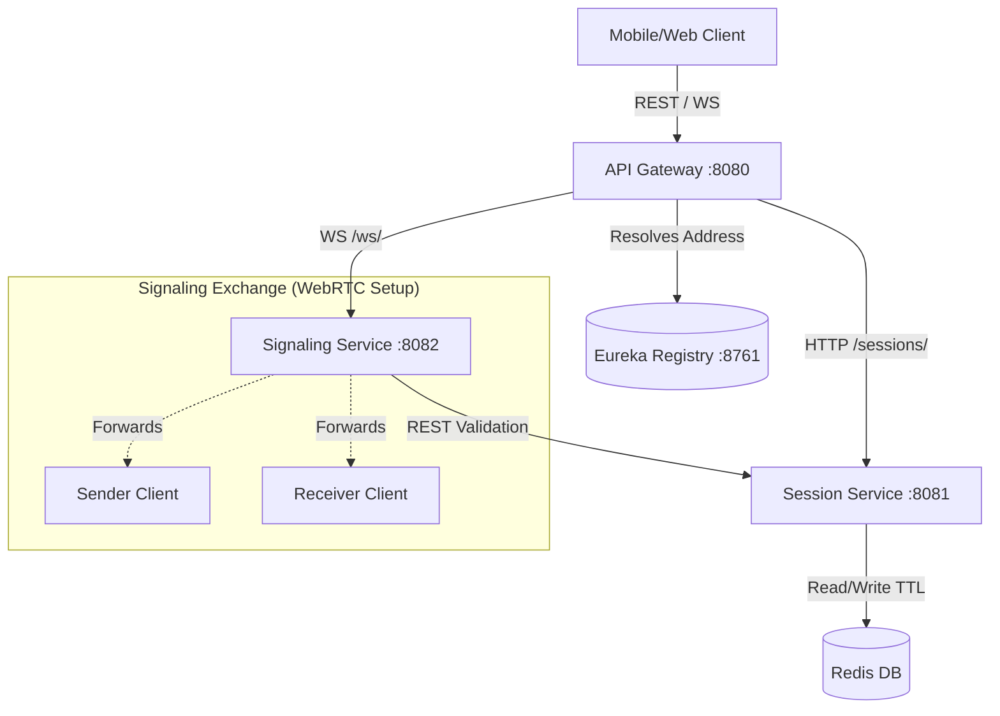

<!-- markdownlint-disable MD033 MD041 -->
<div align="center">
  <!-- You can replace this placeholder with a real logo if you have one -->
  <h1>🌐 ConnectX  </h1>
  
  <p>
    <strong>A highly-scalable, real-time microservices architecture powering peer-to-peer WebRTC connections.</strong>
  </p>

  <p>
    <a href="#-overview">Overview</a> •
    <a href="#-project-status--roadmap">Roadmap</a> •
    <a href="#-features">Features</a> •
    <a href="#-tech-stack">Tech Stack</a> •
    <a href="#-api-documentation">API Docs</a> •
    <a href="#-getting-started">Getting Started</a>
  </p>

  <p>
    
    
    
    
    
  </p>
</div>

---

## 📖 Overview

**ConnectX** is a secure platform engineered to create limited-time sessions, enabling end-to-end encrypted direct peer connections via WebRTC. It removes the need for storing user files on the server directly—behaving purely as a dynamic "switchboard operator".

This backend is structured using a **Spring Boot Microservices Architecture**, broken down into specific boundary contexts: API Gateway routing, Service Registry, Session Management, and WebSocket Signaling.

---

## 🗺️ Project Status & Roadmap

> **Current Status**: ✅ Core Backend Complete (Local/Network Tested)

| Phase | Feature | Status |
| :--- | :--- | :--- |
| **Phase 1** | Microservice Infrastructure (Eureka, Gateway) | ✅ **Completed** |
| **Phase 1** | Redis Session Management & JWT | ✅ **Completed** |
| **Phase 2** | Signaling Server via WebSockets | ✅ **Completed** |
| **Phase 3** | End-to-End Testing scripts | ✅ **Completed** |
| **Future** | Dockerization & Cloud Deployment | 📅 *Planned* |
| **Future** | Centralized Logging & Tracing (Zipkin/Sleuth) | 📅 *Planned* |

---

## ✨ Features

<table>
  <tr>
    <td width="50%">
      <h3>🔒 Robust Security</h3>
      <ul>
        <li><strong>JWT Authentication</strong>: Stateless & Scalable user signaling verification.</li>
        <li><strong>API Gateway</strong>: Single entry point protecting backend services.</li>
        <li><strong>Rate Limiting</strong>: Redis-backed token bucket limiting abuse per IP.</li>
      </ul>
    </td>
    <td width="50%">
      <h3>⚡ Real-Time Signaling</h3>
      <ul>
        <li><strong>Concurrent WebSockets</strong>: Safely manages active `SessionId` -> `WebSocketSession` mappings.</li>
        <li><strong>P2P Mediation</strong>: Flawlessly forwards <code>OFFER</code>, <code>ANSWER</code>, and <code>ICE_CANDIDATE</code> payloads.</li>
        <li><strong>Session Validation</strong>: Signaling constantly verifies with SessionService over HTTP.</li>
      </ul>
    </td>
  </tr>
  <tr>
    <td width="50%">
      <h3>⏱️ Ephemeral State</h3>
      <ul>
        <li><strong>Redis Database</strong>: In-memory Datastore for ⚡ instant read/writes.</li>
        <li><strong>Self-Destructing Rooms</strong>: Sessions automatically expire (TTL: 5m to 1hr).</li>
        <li><strong>No File Storage</strong>: True privacy. Files never rest on the server.</li>
      </ul>
    </td>
    <td width="50%">
      <h3>🏗️ Modern Architecture</h3>
      <ul>
        <li><strong>Eureka Registry</strong>: Dynamic Service Discovery. No hardcoded IPs.</li>
        <li><strong>Spring Boot</strong>: Standalone, production-ready microservices.</li>
        <li><strong>Event-Driven</strong>: Seamless JSON messaging layer.</li>
      </ul>
    </td>
  </tr>
</table>

---

## 🛠️ Tech Stack

| Component | Technology | Description |
| :--- | :--- | :--- |
| **Language** | Java 17+ | Core language processing backend logic. |
| **Framework** | Spring Boot 3.x | Core framework for DI & Application Context. |
| **Database** | Redis | Ephemeral session persistence with auto-TTL. |
| **Gateway** | Spring Cloud Gateway | Edge routing and Redis Rate Limiter. |
| **Discovery** | Netflix Eureka | Dynamic service registry and load balancer resolution. |
| **Security** | JSON Web Tokens | Compact, URL-safe claim payloads. |

---

## 🧠 The Architecture: Microservices Flow

ConnectX functions via independent services talking dynamically to one another. 

### 1. The Gateway (`8080`)
Acts as the **School Gatekeeper**. Directs `/api/sessions/**` to the Session Service and `/ws/**` to the Signaling Service.

### 2. The Eureka Server (`8761`)
Acts as the **Phonebook**. Services boot up and say "I am here", allowing the Gateway and other services to find them dynamically without hardcoded IPs.

### 3. The Session Service (`8081`)
Acts as the **Room Manager**. Uses Redis to create JSON session entities holding an ID, limits, and expiration times. Issues the JWTs.

### 4. The Signaling Service (`8082`)
Acts as the **Switchboard Operator**. Holds active WebSocket lines. It validates users via JWT and checks with the Session Service if the room exists before brokering WebRTC data.

### 🔄 System Design Flow


---

## 📚 API Documentation

### 🔑 Key Endpoints

| Method | Endpoint | Description | Auth? |
| :--- | :--- | :--- | :--- |
| `POST` | `/api/sessions/create` | Generates a new room, returns Session ID & Sender JWT | ❌ |
| `POST` | `/api/sessions/{sessionId}/join` | Validates session, returns Receiver JWT | ❌ |
| `GET` | `/api/sessions/{sessionId}/validate` | Boolean check if session is active | ❌ |
| `WS` | `ws://[IP]:8080/ws?token={jwt}` | Connects to the Signaling switchboard | ✅ (Token) |

### 📝 Example Request (cURL)

**Create a Session:**
```bash
curl -X POST "http://localhost:8080/api/sessions/create" \
  -H "Content-Type: application/json"
```

---

## ✅ Prerequisites

Ensure you have the following installed before running locally:

*   **Java 17+** (JDK) 
*   **Redis** (Listening on `localhost:6379`) 
*   **Maven 3.9+** 

## 🚀 Getting Started

<details>
<summary><strong> Running from Source</strong></summary>

1.  **Clone & Configure**:
    Create a `.env` in the root folder with the following:
    ```env
    JWT_SECRET=replace_this_with_a_long_secure_random_string_for_production
    EUREKA_URI=http://192.168.29.245:8761/eureka
    REDIS_HOST=localhost
    ```
2.  **Start the Services (In exact order)**:
    Open multiple terminal windows and run `mvn spring-boot:run` in the following folders:
    1.  `EurekaServer`
    2.  `SessionService`
    3.  `SignalingService`
    4.  `Gateway`
3.  **Access**:
    The combined API is now listening at `http://localhost:8080`
</details>

---

## 📂 Project Structure

This Multi-Module maven architecture cleanly separates concerns:

```bash
m:\ConnectX
├── EurekaServer/            # Service Registry (Port 8761)
│   └── application.yml      # Disables self-registration
├── Gateway/                 # Edge Server (Port 8080)
│   ├── config/              # IpKeyResolver.java (Rate Limiter Logic)
│   └── application.yml      # Routes definition
├── SessionService/          # Session Management (Port 8081)
│   ├── Controller/          # REST Endpoints
│   ├── Repository/          # Redis CRUD logic
│   └── Security/            # JWT Generation
└── SignalingService/        # WebSocket Broker (Port 8082)
    ├── Handler/             # SignalingWebSocketHandler.java
    └── Service/             # SessionServiceClient (Internal HTTP Calls)
```

---

<div align="center">
  <p>
    <sub> Engineered and Developed by <a href="https://github.com/Mahir-Agarwal">Mahir Agarwal</a></sub>
  </p>
</div>

<!-- GitHub Stats Widgets -->
<div align="center">
  
</div>

<div align="center">
  
</div>
